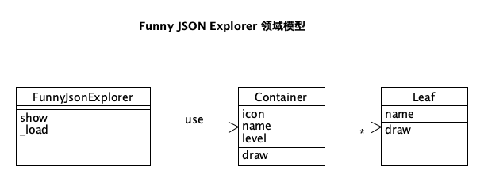

# Defign Pattern

## 1.作业要求

**Funny JSON Explorer**

Funny JSON Explorer（**FJE**），是一个JSON文件可视化的命令行界面小工具

```shell
fje -f <json file> -s <style> -i <icon family>

```

```
{
    oranges: {
        'mandarin': {                            ├─ oranges
            clementine: null,                    │  └─ mandarin
            tangerine: 'cheap & juicy!'  -=>     │     ├─ clementine
        }                                        │     └─ tangerine: cheap & juicy!
    },                                           └─ apples
    apples: {                                       ├─ gala
        'gala': null,                               └─ pink lady
        'pink lady': null
    }
}
````

FJE可以快速切换**风格**（style），包括：树形（tree）、矩形（rectangle）；

```
├─ oranges                             ┌─ oranges ───────────────────────────────┐
│  └─ mandarin                         │  ├─ mandarin ───────────────────────────┤
│     ├─ clementine                    │  │  ├─ clementine ──────────────────────┤
│     └─ tangerine: cheap & juicy!     │  │  ├─ tangerine: cheap & juicy! ───────┤
└─ apples                              ├─ apples ────────────────────────────────┤
   └─ gala                             └──┴─✩gala ───────────────────────────────┘

        树形（tree）                                   矩形（rectangle）


┌─ oranges ───────────────────────────────┐
│  ├─ mandarin ───────────────────────────┤
│  │  ├─ clementine ──────────────────────┤
│  │  ├─ tangerine: cheap & juicy! ───────┤
├─ apples ────────────────────────────────┤
|  ├─ gala ───────────────────────────────┤
└──┴─pink lady────────────────────────────┘

   ├── ♢ oranges--------------------------------
   │  └── ♢ mandarin----------------------------
   │     ├── ♢ clementine-----------------------
   │     └── ♢ tangerine: cheap & juicy!--------
   └── ♢ apples---------------------------------
      ├── ♢ gala--------------------------------
      └── ♢ pink lady---------------------------
      
┌─  oranges─────────────────────────────────────────────────────────────────┐
├───├  mandarin─────────────────────────────────────────────────────────────┤
├   │  ─  clementine────────────────────────────────────────────────────────┤
├   │  ─  tangerine: cheap & juicy!─────────────────────────────────────────┤
├─  apples──────────────────────────────────────────────────────────────────┤
├   ─  gala─────────────────────────────────────────────────────────────────┤
└──┴─  pink lady────────────────────────────────────────────────────────────┘
````

也可以指定**图标族**（icon family），为中间节点或叶节点指定一套icon

```
├─♢oranges                                 
│  └─♢mandarin                             
│     ├─♤clementine                        
│     └─♤tangerine: cheap & juicy!    
└─♢apples                                  
   └─♤gala                                 

poker-face-icon-family: 中间节点icon：♢ 叶节点icon：♤                 
```

**领域模型**




基于上述需求描述和领域模型，按照设计模式要求，进行软件设计，并编码实现（任何语言均可）。

**设计模式**

使用**工厂方法**（Factory）、**抽象工厂**（Abstract Factory）、**建造者**（Builder）模式、**组合模式**（Composition），完成功能的同时，使得程序易于扩展和维护。

1. （必做）：不改变现有代码，只需添加新的抽象工厂，即可添加新的风格
2. （选做）：通过配置文件，可添加新的图标族


## 2.设计文档

### 2.1 UML类图


### 2.2使用的设计及模式和作用

#### 2.1.1 Builder模式
**类**：JsonBuilder

**作用**：Builder模式用于简化复杂对象的创建过程，将对象的构建过程与其表示分离。

**具体实现**：JsonBuilder 类包含一个构建JSON树的过程，提供了方法来构建根容器、添加子容器和叶子节点，并最终生成一个包含所有元素的根容器。这样可以避免在构建复杂对象时的构造器重叠和参数混乱。

#### 2.2.2  组合模式
**类**：Container, Leaf

**作用**：组合模式用于处理树形结构的对象，可以一致地处理单个对象和组合对象。

**具体实现**：Container 类和 Leaf 类共同实现了组合模式。Container 类可以包含多个 Leaf 或 Container 对象，而每个 Leaf 对象则代表一个具体的节点。这样，整个树结构可以被当作一个整体来处理，无论是叶子节点还是容器节点都可以使用统一的接口进行操作。

#### 2.2.3 工厂模式
**类**：IconFactory 接口, ChessIconFactory, PokerFaceIconFactory, SimpleIconFactory

**作用**：工厂模式定义了创建对象的接口，让子类决定实例化哪一个类，使得代码灵活、可扩展。

**具体实现**：IconFactory 接口定义了获取图标的方法。具体的实现类如 ChessIconFactory, PokerFaceIconFactory等，提供了不同风格的图标生成方法。***通过使用 IconFactory接口，可以在不修改现有代码的情况下更换图标样式。***

#### 2.2.4  抽象工厂模式
**类**：Factory 接口, AbstractStyleFactory 抽象类, RectangleStyleFactory, TreeStyleFactory

**作用**：抽象工厂模式提供了创建一系列相关或相互依赖对象的接口且无需指定它们具体的类，可以确保创建一族相关的对象实例时的一致性。

**具体实现**：Factory 接口定义了创建 Container 和 Leaf 对象的方法。AbstractStyleFactory 提供了这些方法的默认实现，并定义了一些抽象方法供子类实现。具体的工厂类如RectangleStyleFactory 和 TreeStyleFactory 继承了 AbstractStyleFactory，实现了其中特定的绘制逻辑。***当需要增加新的绘制风格时，只需创建新的工厂类并继承 AbstractStyleFactory即可。***


## 3.运行结果

- 两个style：tree、rectangle
- 三种icon：pokerface、chess、simple（对不上名字的默认simple）

### 3.1 IDE中运行


### 3.2 终端中运行:

在window中进入cmd到项目根目录。

更改命令提示符的编码为 UTF-8：

```sh
chcp 65001
```

运行项目

```bash
java -cp "bin;lib/gson-2.8.2.jar" main.FunnyJsonExplorer
```

结果截图如下：


注：pokerface风格在终端中出现对不齐的问题


